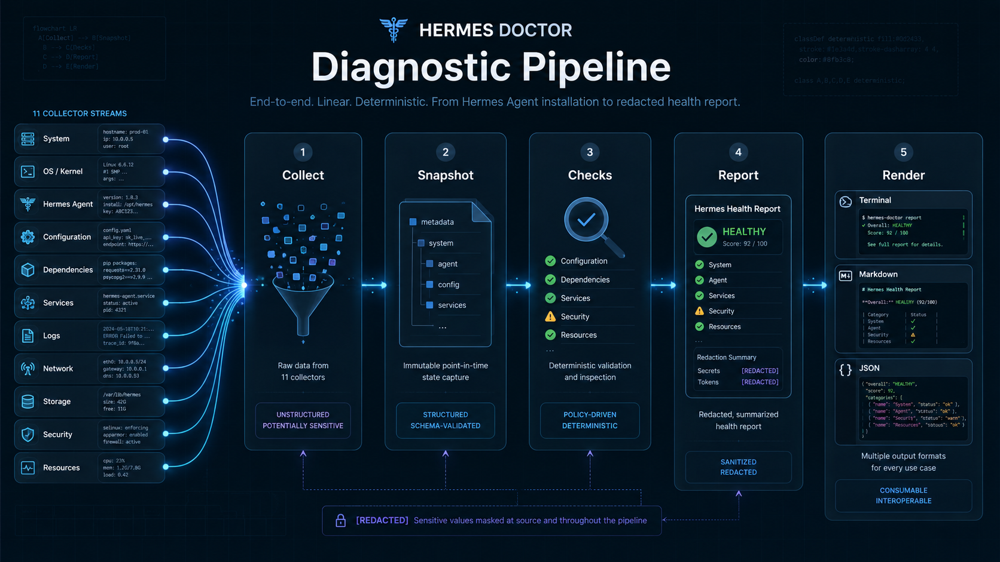

# Hermes Doctor

> **Local-first diagnostic CLI for [Hermes Agent](https://github.com/FactoryAI/hermes).**  
> Scans your Hermes installation, configuration, providers, MCP servers, memory, skills, plugins, logs, and security posture. Delivers a redacted, evidence-backed health report with actionable fix commands.

Hermes Doctor runs deterministically, offline-first. No API key. No network access. Every check is local and stateless. An optional [Flue](https://flue.dev) integration enriches reports with AI explanations when you explicitly pass `--flue`.



## Features

**11 diagnostic areas.** System, install, config, dashboard, providers, MCP, memory, skills, plugins, logs, security. Each area has its own collector and check suite.

**55+ deterministic checks.** Every check is pass/fail/warn with evidence and copyable fix commands. A scan of a real Hermes install surfaced 56 findings across 909 tests.

**No API key required.** Works offline in default mode: no outbound internet calls, local diagnostics only.

**Defense-in-depth redaction.** Secrets get caught at the collection boundary and again at render time. A second redaction pass runs on every output format; nothing slips through.

**Three output formats.** Console with color, markdown for GitHub or Discord, and schema-validated JSON.

**CI-friendly.** Exit code 0 on completed scans (findings or not), exit code 1 only on tool failures.

**Run without installing.** `npx hermes-doctor` works from any Node >= 20 environment.

**Optional Flue enrichment.** AI-powered explanations via `--flue` when you supply an LLM API key.

## Quick Start

### Prerequisites

- **Node.js >= 20** (LTS recommended)
- **pnpm** (for development) or **npx** (for ad-hoc usage)

### One-shot scan

```bash
npx hermes-doctor scan
```

This auto-detects your Hermes home (`~/.hermes`), runs all collectors and checks, and prints a colored health report to the console.

### Scan a specific Hermes home

```bash
npx hermes-doctor scan --hermes-home /path/to/.hermes
```

### Save report as markdown and JSON

```bash
npx hermes-doctor scan \
  --format markdown \
  --format json \
  --output ./report
```

This writes `hermes-doctor-report.md` and `hermes-doctor-report.json` to `./report/`.

### Version and paths

```bash
npx hermes-doctor version
npx hermes-doctor paths
npx hermes-doctor paths --hermes-home /custom/path
```

### Using with Flue (optional AI enrichment)

```bash
export FLUE_API_KEY="your-key"
npx hermes-doctor scan --flue
```

## Privacy Model

Your data never leaves your machine unless you explicitly enable Flue.

| Concern | How Doctor Handles It |
|---------|----------------------|
| **Data collection** | All collectors are read-only. They never modify Hermes files. |
| **Network calls** | No outbound internet calls (local diagnostics only) in default mode. Dashboard checks probe `127.0.0.1` only (1500ms timeout). No remote URLs are ever contacted. |
| **API keys & secrets** | Pattern matching detects secrets and replaces them with `[REDACTED:TYPE]` at the collector boundary. A second redaction pass runs on all rendered output. |
| **Home paths** | Local home paths like `/home/user/.hermes` normalize to `<HOME>/.hermes`. |
| **Log content** | Log snippets are optional (`--include-log-snippets`) and always redacted before display. |
| **Strict mode** | `--strict-redaction` enables extra-aggressive redaction for base64 strings and env values. |
| **Flue mode** | Only when `--flue` is explicitly passed does report data reach the configured LLM provider. Never enabled by default. |

### Redacted for Sharing

All reports are redacted for sharing. Every output format (console, markdown, JSON) receives a final redaction pass that catches any accidentally included secrets. The JSON report includes a `redactedForSharing: true` field. No raw API keys, tokens, or passwords appear in any generated report.

## Example Output

### Console (colored terminal)

```
Hermes Doctor — Health Report
Generated: ...  |  Profile: default
Hermes Home: <HOME>/.hermes

Summary
  [OK] 5 OK | [INFO] 3 Info | [WARN] 2 Warnings | [BROKEN] 1 Broken | [RISK] 1 Risk | Total: 12

OK (5)
  [  OK] System Information
         OS: linux, Arch: x64, Node: v20.18.0
         Evidence:
           os: linux
           arch: x64

WARN (2)
  [WARN] MCP command not found
         Command 'bogus' is not available on PATH
         Evidence:
           server: fs
           command: bogus
         Fix:
           Install the MCP server
           $ npm install -g @modelcontextprotocol/server-fs

RISK (1)
  [ RISK] Dashboard Publicly Bound
         Dashboard is bound to 0.0.0.0, accessible from any network
         Evidence:
           public_binding: true
           bind_address: 0.0.0.0
         Fix:
           Bind to localhost only
           $ set HERMES_DASHBOARD_BIND=127.0.0.1

──────────────────────────────────────────────────
This report has been redacted for sharing.
```

### Markdown (GitHub/Discord)

```markdown
# Hermes Doctor — Health Report

_Generated: ... | Profile: default_

| Status | Count |
|--------|-------|
| [OK] OK | 5 |
| [WARN] Warnings | 2 |
| [BROKEN] Broken | 1 |
| [RISK] Risks | 1 |
| **Total** | **12** |

## [RISK] Risk (1)

### Dashboard Publicly Bound

**Status:** [RISK] Risk

Dashboard is bound to 0.0.0.0, accessible from any network.

**Fix:**

- **Bind to localhost only**
  ```bash
  set HERMES_DASHBOARD_BIND=127.0.0.1
  ```

## Privacy

> This report has been redacted for sharing. All detected secrets have been redacted.
```

### JSON (machine-readable)

```json
{
  "schemaVersion": "1.0",
  "generatedAt": "...",
  "profile": "default",
  "summary": {
    "ok": 5, "info": 3, "warnings": 2,
    "broken": 1, "risks": 1, "unknown": 0,
    "total": 12
  },
  "findings": [ ... ],
  "redaction": {
    "redacted": true,
    "totalRedactions": 3,
    "patterns": ["openai_key"]
  },
  "redactedForSharing": true
}
```

## CLI Reference

### Commands

| Command | Description |
|---------|-------------|
| `scan` | Run a full health scan |
| `export` | Re-export the most recent scan report |
| `paths` | Print detected Hermes paths |
| `version` | Print version number |
| `--help`, `-h` | Print help information |
| `--version`, `-V` | Print version |

### Scan options

| Option | Description | Default |
|--------|-------------|---------|
| `--hermes-home <path>` | Path to Hermes home directory | `$HERMES_HOME` or `~/.hermes` |
| `--profile <name>` | Hermes profile to scan | `default` |
| `--format <format>` | Output format (`console`, `markdown`, `json`). Repeatable. | `console` |
| `--output <dir>` | Directory to write report files to | stdout |
| `--verbose` | Include extra diagnostic detail | `false` |
| `--flue` | Enable Flue AI enrichment | `false` |
| `--no-flue` | Explicitly disable Flue | default |
| `--include-log-snippets` | Include redacted log excerpts | `false` |
| `--max-log-lines <n>` | Max lines per log file | `500` |
| `--strict-redaction` | Extra-aggressive redaction | `false` |

### Export options

| Option | Description | Default |
|--------|-------------|---------|
| `--last` | Re-export the most recent scan | required |
| `--format <format>` | Output format (`markdown`, `json`) | `markdown` |
| `--output <dir>` | Directory where the last report was stored | `./hermes-doctor-report` |

### Exit codes

| Code | Meaning |
|------|---------|
| `0` | Scan completed successfully (even with findings) |
| `1` | Tool or runtime failure (invalid args, write error, crash) |
| `2` | Reserved for future `--fail-on-risk` mode |

## Diagnostics Coverage

Hermes Doctor runs **55+ deterministic checks** across 11 diagnostic areas:

| Area | What's Checked |
|------|----------------|
| **System** | OS, architecture, Node version, shell, PATH, Docker, Git |
| **Install** | Hermes executable presence, PATH, version, install method, permissions |
| **Config** | Config file existence, YAML parse, profiles, sections, schema errors |
| **Dashboard** | URL reachability, bind address, localhost check, auth, TLS |
| **Providers** | Configured providers, required env vars, API key format, local endpoints, custom provider base_url, auth.json conflicts, orphaned model references |
| **MCP** | Server commands, executable availability, transport validity, env vars |
| **Memory** | Directory existence, file count, size, usage percent, readability |
| **Skills** | Directory structure, SKILL.md presence, metadata completeness, broken refs |
| **Plugins** | Plugin manifests, existence, dependencies, compatibility |
| **Logs** | File readability, error count, error type classification, snippets |
| **Security** | Public binding, secret leaks, shell restrictions, sandbox, permissions, dynamic exec |

## Development

### Setup

```bash
git clone <repo-url>
cd hermes-doctor
pnpm install
```

### Available commands

```bash
pnpm dev           # Run the CLI with tsx (no build required)
pnpm test          # Run all tests (vitest)
pnpm typecheck     # Type-check all packages
pnpm lint          # Lint all packages (ESLint)
pnpm build         # Build all packages (tsc -b)
pnpm clean         # Clean all build artifacts
```

### Project structure

```
hermes-doctor/
├── packages/
│   ├── core/                  # Deterministic diagnostic engine
│   │   ├── schemas/           # Valibot schemas (all types)
│   │   ├── collectors/        # 11 area collectors (read-only)
│   │   ├── checks/            # 55+ deterministic checks
│   │   ├── redaction/         # Pattern-based secret detection
│   │   ├── report/            # Report builder & summary
│   │   └── utils/             # fs, paths, exec, platform utilities
│   ├── cli/                   # Commander-based CLI
│   │   ├── commands/          # scan, export, paths, version
│   │   └── output/            # console, markdown, JSON renderers
│   └── flue-workflows/        # Optional Flue enrichment
├── fixtures/                  # Test fixture Hermes homes
│   ├── hermes-good/
│   ├── hermes-missing-provider/
│   ├── hermes-broken-mcp/
│   ├── hermes-risky-dashboard/
│   ├── hermes-memory-full/
│   └── logs/
└── eslint.config.js
```

### Testing with fixtures

```bash
# Scan a specific fixture
pnpm dev -- --hermes-home ./fixtures/hermes-good

# Scan broken MCP fixture in markdown format
pnpm dev -- \
  --hermes-home ./fixtures/hermes-broken-mcp \
  --format markdown \
  --output ./tmp-report
```

### Architecture

```
Hermes Home (~/.hermes)
    │
    ▼
┌─────────────────┐
│   Collectors    │  Read-only, timeout-bounded, redacted at boundary
└────────┬────────┘
         │
         ▼
┌─────────────────┐
│ HermesSnapshot  │  Typed, validated, redacted intermediate
└────────┬────────┘
         │
         ▼
┌─────────────────┐
│     Checks      │  55+ deterministic pass/fail/warn
└────────┬────────┘
         │
         ▼
┌─────────────────┐
│  Report Builder │  Summary counts, severity mapping
└────────┬────────┘
         │
    ┌────┴────┐
    ▼         ▼
  --flue   --no-flue
    │         │
    ▼         ▼
┌──────────────────────┐
│    Renderers         │  Final redaction pass
│ console | md | json  │
└──────────────────────┘
```

### Key design principles

- **Deterministic by default**: zero API keys, no outbound internet calls (local diagnostics only), zero external dependencies at runtime
- **Defense-in-depth redaction**: secrets caught at collection boundary and in every renderer
- **Never throw**: every collector returns partial results on failure
- **Static analysis only**: never execute MCP server commands or mutate Hermes files
- **Node >= 20**: uses current LTS features, not tied to any specific version

## Roadmap

| Milestone | Status |
|-----------|--------|
| Foundation: workspace, schemas, redaction, CLI skeleton | [OK] Complete |
| Collectors: all 11 area collectors + HermesSnapshot builder | [OK] Complete |
| Fixtures: 5 fixture homes with realistic configs and logs | [OK] Complete |
| Checks & Reports: 55+ checks, 3 renderers, integration tests | [OK] Complete |
| Flue Integration: optional AI enrichment with graceful degradation | [OK] Complete |
| Polish: full CLI options, export/paths commands, exit code policy | [OK] Complete |
| **Hardening**: comprehensive README, edge cases, quality gates | **[OK] Complete** |

### Future ideas

- `hermes-doctor watch`: continuous monitoring mode
- `hermes-doctor fix`: auto-apply safe fix commands
- `--fail-on-risk`: exit code 2 when risks are detected (CI mode)
- HTML report format with interactive filtering
- JSON Schema export for CI pipeline integration
- macOS and Windows installer paths auto-detection

## License

MIT
