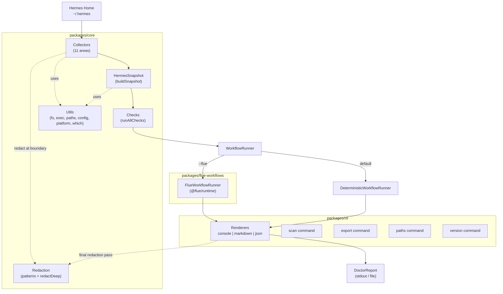

# Hermes Doctor — Comprehensive Codebase Survey

> Generated: 2026-05-31 | Profiling the entire monorepo for wiki/page generation

---

## 1. Repo Summary

**Hermes Doctor** is a local-first, deterministic diagnostic CLI tool for the Hermes Agent. It scans a Hermes installation (`~/.hermes`) across 11 diagnostic areas — system, install, config, dashboard, providers, MCP, memory, skills, plugins, logs, and security — then produces a redacted, evidence-backed health report in console, markdown, or JSON format. The tool requires no API key and makes no outbound internet calls in default mode (dashboard probes are limited to localhost with a 1500ms timeout — local diagnostics only). An optional **Flue** integration can enrich findings with AI-generated explanations when explicitly enabled via `--flue`. All data is redacted at the collector boundary and again at render time; reports are marked `redactedForSharing: true`.

The repo is a **pnpm monorepo** (Node.js ≥ 20, TypeScript 5.7, Vitest 4.x) with three packages under `packages/`:

| Package | Role |
|---------|------|
| `@hermes-doctor/core` | Deterministic diagnostic engine (schemas, collectors, checks, redaction, report builder) |
| `hermes-doctor` (CLI) | Commander-based CLI with 4 commands and 3 output renderers |
| `@hermes-doctor/flue-workflows` | Optional AI-enrichment layer using `@flue/runtime` (dynamically loaded) |

---

## 2. Architecture Overview

### Data Flow

```
Hermes Home (~/.hermes)
        │
        ▼
┌──────────────────┐
│    Collectors    │  Read-only, timeout-bounded, redacted at boundary
│    (11 areas)    │  Each returns CollectorResult<T> with status/evidence/warnings
└────────┬─────────┘
         │
         ▼
┌──────────────────┐
│  buildSnapshot() │  Merges CollectorResults → validated HermesSnapshot
│  (snapshot/      │  Scans for [REDACTED:TYPE] markers for summary
│   builder.ts)    │
└────────┬─────────┘
         │
         ▼
┌──────────────────┐
│   runAllChecks() │  50+ deterministic pass/fail/warn checks
│   (checks/       │  Each check returns DoctorFinding[]
│    index.ts)     │
└────────┬─────────┘
         │
    ┌────┴────┐
    ▼         ▼
 --flue    --no-flue
    │         │
    ▼         ▼
┌──────────────────────────┐
│    WorkflowRunner        │  DeterministicWorkflowRunner (default)
│  FlueWorkflowRunner      │  or FlueWorkflowRunner (--flue)
└──────────┬───────────────┘
           │
           ▼
┌──────────────────────────┐
│      Renderers           │  Final redaction pass
│  console | markdown | json│  Schema-validated output
└──────────────────────────┘
```

### Mermaid Diagram



### Key Design Principles

1. **Deterministic by default** — zero API keys, no outbound internet calls (local diagnostics only), zero external runtime deps
2. **Defense-in-depth redaction** — secrets caught at collection boundary AND in every renderer
3. **Never throw** — every collector returns partial results on failure; checks produce synthetic error findings
4. **Static analysis only** — never executes MCP server commands or mutates Hermes files
5. **Read-only** — all collectors only read; no file writes, no configuration changes
6. **Node ≥ 20** — uses ESM, `import.meta`, modern Node features

---

## 3. Discovered Topics — Complete Feature & Primitive Inventory

### Packages

| Topic | Description |
|-------|-------------|
| `@hermes-doctor/core` | Deterministic diagnostic engine — schemas, collectors, checks, redaction, report builder, snapshot builder, utilities |
| `hermes-doctor` (CLI) | Commander-based CLI entry point — `scan`, `export`, `paths`, `version` commands |
| `@hermes-doctor/flue-workflows` | Optional Flue AI enrichment — `FlueWorkflowRunner`, `explainFinding()` |

### Schemas (`packages/core/src/schemas/`)

| Topic | Description |
|-------|-------------|
| `common.ts` — Finding areas, statuses, severity, evidence, fix actions | Shared Valibot schemas and types for the entire system |
| `collector.ts` — `CollectorResult<T>` | Generic wrapper for collector output: area, status, data, evidence, warnings, errors |
| `snapshot.ts` — `HermesSnapshot` + 11 area snapshots | The complete typed, validated intermediate representation after collection |
| `report.ts` — `DoctorReport`, `DoctorFinding`, `Summary` | The final output schema; validated before serialization |

### Collectors (`packages/core/src/collectors/`)

| Topic | Description |
|-------|-------------|
| `system` | OS, architecture, Node version, shell, PATH, Docker, Git |
| `install` | Hermes executable on PATH, version string, install method (npm/pip/binary/docker), permissions |
| `config` | config.yaml existence, YAML parse, profile list, section detection |
| `dashboard` | Dashboard URL, bind address, localhost probe (HTTP fetch with timeout), auth, TLS |
| `providers` | Known providers list (Anthropic, OpenAI, Google, etc.), API key env vars, key format validation, local endpoint probing |
| `mcp` | MCP server configs, command executables on PATH, transport validation, env vars, tool filters |
| `memory` | Memory file inventory, dir existence/readability, file sizes, secret scanning, limit detection, external provider config, duplicate/misplaced config detection |
| `skills` | SKILL.md presence, YAML frontmatter parsing, broken local references, duplicate names, large files |
| `plugins` | Plugin directory scanning, manifest (plugin.json/manifest.json/package.json) parsing, dependency detection, Hermes version compatibility |
| `logs` | Log file discovery, error line pattern matching, error type classification (auth/model/mcp/permission/rate_limit/network/unknown), log snippets |
| `security` | Public binding detection, secret leak scanning in config/env/skills/plugins, terminal backend security, file permissions, env var exposure, dynamic exec patterns |

### Checks (`packages/core/src/checks/`)

| Topic | Area | Key Checks |
|-------|------|------------|
| System (4 checks) | system | System info, shell env, Docker, Git |
| Install (4 checks) | install | Executable found, version detected, install method, permissions |
| Config (5 checks) | config | Home exists, config parseable, profiles, sections, schema conformance |
| Dashboard (4 checks) | dashboard | Reachability, localhost binding, auth, TLS |
| Providers (4 checks) | providers | Default model, env vars, local endpoints, key format |
| MCP (5 checks) | mcp | Servers configured, commands executable, env vars, tool filters, transports |
| Memory (8 checks) | memory | Files exist, file sizes, limit usage, external provider, secrets, huge files, duplicate config, wrong section |
| Skills (5 checks) | skills | SKILL.md present, broken refs, duplicate names, large files, metadata |
| Plugins (5 checks) | plugins | Paths exist, manifests parseable, dependencies, version compat, wrong section |
| Logs (4 checks) | logs | Recent errors, error classification, readability, rate limits |
| Security (5 checks) | security | Public binding, secret leaks, terminal backend, file permissions, env exposure, dynamic exec |

### Redaction (`packages/core/src/redaction/`)

| Topic | Description |
|-------|-------------|
| `patterns.ts` — `REDACTION_PATTERNS` | 15 primary patterns: SSH keys, webhook tokens, passwords, bearer tokens, auth headers, Anthropic/OpenAI keys, GitHub/Slack/Telegram tokens |
| `patterns.ts` — `STRICT_REDACTION_PATTERNS` | 2 aggressive patterns: base64 strings, any SECRET/TOKEN/KEY-prefixed env values |
| `redact.ts` — `redact()` | String-level redaction with pattern matching and home path normalization |
| `redact.ts` — `redactDeep()` | Recursive redaction of any value (objects, arrays, strings) |
| `redact.ts` — `mergeRedactionSummaries()` | Aggregates multiple redaction summaries |
| `RedactionOptions` | Controls: `homeDir`, `redactHomePaths`, `strictRedaction` |
| Home path redaction | Paths like `/home/user/.hermes` → `<HOME>/.hermes` |

### Report Building (`packages/core/src/report/`)

| Topic | Description |
|-------|-------------|
| `buildReport()` | Computes summary counts (ok/info/warnings/broken/risks/unknown/total), validates against `DoctorReportSchema` |
| `updateReportRedaction()` | Merges renderer-level redaction deltas into report |

### Snapshot Building (`packages/core/src/snapshot/`)

| Topic | Description |
|-------|-------------|
| `buildSnapshot()` | Merges `CollectorResults` into `HermesSnapshot`, scans for redaction markers, validates against `HermesSnapshotSchema` |

### CLI (`packages/cli/src/`)

| Topic | Description |
|-------|-------------|
| `program.ts` — `buildProgram()` | Commander program factory with 4 subcommands |
| `commands/scan.ts` | Full scan pipeline: resolve home → collect → snapshot → checks → render |
| `commands/export.ts` | Re-export last scan report (finds by mtime, supports JSON→MD conversion) |
| `commands/paths.ts` | Print all detected Hermes paths with existence checks |
| `commands/version.ts` | Print version from package.json |
| `output/console-renderer.ts` | Colored terminal output with severity groups, evidence, fix commands, redaction summary |
| `output/markdown-renderer.ts` | GitHub/Discord-friendly markdown with tables, code blocks, emoji badges |
| `output/json-renderer.ts` | JSON serialization with schema validation, pretty-printing, verbose mode |
| `version.ts` | Reads version from `package.json` at runtime |

### Flue Workflows (`packages/flue-workflows/src/`)

| Topic | Description |
|-------|-------------|
| `FlueWorkflowRunner` | Implements `WorkflowRunner`; wraps `DeterministicWorkflowRunner`, then enriches findings via Flue |
| `explainFinding()` | Builds prompt from finding fields, dispatches to `@flue/runtime`, returns enriched finding |
| Graceful degradation | Falls back to deterministic if `@flue/runtime` not installed or no API key; partial enrichment allowed |

### Utilities (`packages/core/src/utils/`)

| Topic | Description |
|-------|-------------|
| `exec.ts` — `runCommand()` | Wrapper around `execa` with timeout, ENOENT detection |
| `fs.ts` | `pathExists()`, `statSafe()`, `readTextFile()`, `listDir()`, `errorMessage()` |
| `which.ts` | `findExecutable()` — PATH resolution with Windows extension support; `executableFromCommand()` |
| `platform.ts` — `getPlatformInfo()` | OS, arch, Node version, shell, PATH |
| `paths.ts` | `resolveHermesHome()` (with `HERMES_HOME` env), `hermesPaths()` (all subdirectories) |
| `config.ts` | `loadHermesConfig()` (YAML parse), `parseEnvFile()`, type-narrowing helpers (`asRecord`, `asArray`, `asString`, `asBoolean`, `asNumber`, `pick`) |

### Runner Abstractions

| Topic | Description |
|-------|-------------|
| `WorkflowRunner` interface | Contract: `runDoctor(snapshot) → DoctorReport` |
| `DeterministicWorkflowRunner` | Default runner using `runAllChecks()` + `buildReport()` |
| `FlueWorkflowRunner` | Decorates deterministic with AI enrichment |

---

## 4. Key Patterns

### Coding Conventions

- **ESM-only**: All files use `import`/`export` with `.js` extensions in relative imports
- **TypeScript strict mode**: `strict: true`, `noUncheckedIndexedAccess`, `noImplicitOverride`, `noFallthroughCasesInSwitch`
- **Valibot for schemas**: All types derived from Valibot schemas via `v.InferOutput<>` (no Zod)
- **`never throw` pattern**: `runArea()` wraps collectors in try/catch; `runAllChecks()` wraps each check in try/catch producing synthetic error findings
- **Empty data pattern**: Each collector defines an `EMPTY` constant for the "no data" case; `runArea()` uses it as fallback
- **Evidence accumulation**: `newAccumulator()` + `addEvidence()` + `finalize()` — all collectors use the same pattern
- **Redaction at boundaries**: `finalize()` calls `redactDeep()` on data; all renderers call `redactDeep()` on final output
- **Defense-in-depth**: Two redaction passes — collector boundary + render time
- **Path normalization**: Home paths redacted to `<HOME>`; cross-platform support via `os.homedir()`

### Error Handling

- **Collectors**: Never throw; return `CollectorResult` with `status: "failed"` and error messages
- **Checks**: Wrapped in try/catch; on error produce synthetic finding with `status: "unknown"` and severity `0`
- **CLI**: Top-level try/catch in each command action; sets `process.exitCode = 1` on failure
- **Dynamic imports**: `createRunner()` in `scan.ts` catches import failures and falls back to deterministic
- **Flue enrichment**: `Promise.allSettled` for findings enrichment; individual failures keep original finding

### Testing Patterns

- **Framework**: Vitest 4.x
- **Test locations**: `__tests__/` directories co-located with source
- **Test file naming**: `*.test.ts` pattern
- **Fixture-based testing**: `fixtures/` directory with realistic Hermes home structures; validation tests scan fixtures and assert findings
- **Collector support**: `packages/core/src/collectors/__tests__/support.ts` — shared helpers for collector tests
- **Integration tests**: CLI-level tests in `packages/cli/src/__tests__/` that run full scan pipelines

---

## 5. Glossary Seeds

| Term | Definition |
|------|------------|
| **Hermes Home** | The `~/.hermes` directory containing config.yaml, .env, skills/, memory/, plugins/, logs/ |
| **HermesSnapshot** | The typed, validated, redacted intermediate representation after all 11 collectors finish |
| **DoctorFinding** | A single diagnostic result: id, area, status (ok/info/warning/broken/risk/unknown), severity (0-4), title, message, evidence, fixes, explanation |
| **DoctorReport** | The final output: schemaVersion, platform, summary counts, findings array, redaction summary |
| **CollectorResult** | Generic wrapper: area, status (collected/partial/skipped/failed), data, evidence, warnings, errors |
| **RedactionSummary** | Tracks: redacted flag, total redactions count, pattern types, home path redactions |
| **WorkflowRunner** | Interface with `runDoctor(snapshot)` — either deterministic or Flue-enhanced |
| **Area** | One of 11 diagnostic domains: system, install, config, dashboard, providers, mcp, memory, skills, plugins, logs, security |
| **Evidence** | Key-value fact attached to a finding: label, detail, optional source |
| **FixAction** | Actionable remediation: title, optional command, description, URL |
| **Flue** | Optional AI enrichment layer; `--flue` enables it; requires `@flue/runtime` and API key |
| **Defense-in-depth redaction** | Two-pass redaction: collector boundary + render time |
| **Strict redaction** | `--strict-redaction` adds aggressive patterns (base64, all env-like values) |
| **Config sections** | Top-level sections in config.yaml: providers, mcp, dashboard, memory, skills, plugins, security |
| **MCP Server** | Model Context Protocol server configuration: name, command, transport, env vars, tool filters |

---

## 6. Directory-to-Purpose Map

| Directory | Purpose | Maps to Topics |
|-----------|---------|----------------|
| `packages/core/src/schemas/` | Valibot type definitions | common, collector, snapshot, report schemas |
| `packages/core/src/collectors/` | Read-only data gathering | 11 area collectors + context, result, probe, data types |
| `packages/core/src/checks/` | Deterministic diagnostic checks | 50+ checks across 11 areas + types + runAllChecks |
| `packages/core/src/redaction/` | Secret/PII detection and masking | patterns, redact, redactDeep, strict patterns |
| `packages/core/src/report/` | Report assembly | buildReport, summary computation |
| `packages/core/src/snapshot/` | Snapshot construction | buildSnapshot, redaction marker scanning |
| `packages/core/src/utils/` | Shared utilities | exec, fs, which, platform, paths, config |
| `packages/core/src/` | Entry point + runners | deterministic-runner, workflow-runner interface, index |
| `packages/cli/src/commands/` | CLI subcommands | scan, export, paths, version |
| `packages/cli/src/output/` | Output renderers | console, markdown, json |
| `packages/cli/src/` | CLI entry | program builder, version reader, index |
| `packages/flue-workflows/src/` | AI enrichment | FlueWorkflowRunner, explainFinding |
| `fixtures/` | Test fixture Hermes homes | 5 main fixtures + extensive validation sub-fixtures |
| `fixtures/validation/` | Validation test fixtures | golden-path, cross-area, dashboard-security, mcp, memory, provider, skills-plugins, logs, redaction-torture |
| `reports/` | Acceptance docs + example reports | ACCEPTANCE_REVIEW, KNOWN_LIMITATIONS, REDTEAM_REDACTION, TEST_MATRIX |
| `reports/examples/` | Example generated reports | golden-clean, mcp-broken-command, provider-missing-key, risky-dashboard (both .md and .json) |

---

## 7. Test Infrastructure

### Test Framework

- **Runner**: Vitest 4.x (`vitest run --passWithNoTests`)
- **Config**: `vitest.config.ts` — includes `packages/**/src/**/*.{test,spec}.ts`, excludes `node_modules` and `dist`
- **Watch mode**: `vitest` (aliased as `pnpm test:watch`)

### Test File Inventory

```
packages/core/src/__tests__/
  workflow-runner.test.ts          — WorkflowRunner interface tests

packages/core/src/schemas/__tests__/
  schemas.test.ts                  — Schema validation tests

packages/core/src/collectors/__tests__/
  collectors.test.ts               — Collector unit tests
  support.ts                       — Shared collector test helpers

packages/core/src/checks/__tests__/
  checks.test.ts                   — Check unit tests (50+ checks)

packages/core/src/redaction/__tests__/
  redaction.test.ts                — Redaction engine tests

packages/core/src/report/__tests__/
  builder.test.ts                  — Report builder tests

packages/core/src/snapshot/__tests__/
  builder.test.ts                  — Snapshot builder tests

packages/cli/src/__tests__/
  cli.test.ts                      — CLI smoke tests
  integration.test.ts              — Full pipeline integration tests
  validation-golden-path.test.ts   — Golden-path validation (hermes-good fixture)
  validation-mcp.test.ts           — MCP area validation
  validation-memory.test.ts        — Memory area validation
  validation-provider.test.ts      — Provider area validation
  validation-dashboard-security.test.ts — Dashboard + security validation
  validation-skills-plugins.test.ts — Skills + plugins validation
  validation-log-classification.test.ts — Log error classification validation
  validation-redaction-torture.test.ts  — Redaction torture tests
  validation-cross-area-audit.test.ts   — Cross-area contamination + audit tests
  validation-cli-ux.test.ts        — CLI UX tests
  cross-polish.test.ts             — Cross-cutting polish tests
  format-output-validation.test.ts — Output format validation
  group-cli-options.test.ts        — CLI option grouping tests

packages/cli/src/output/__tests__/
  console-renderer.test.ts         — Console renderer tests
  markdown-renderer.test.ts        — Markdown renderer tests
  json-renderer.test.ts            — JSON renderer tests

packages/flue-workflows/src/__tests__/
  explain-finding.test.ts          — explainFinding tests
  flue-runner.test.ts              — FlueWorkflowRunner tests
```

### Test Fixtures

| Fixture | Purpose |
|---------|---------|
| `hermes-good/` | Healthy Hermes installation (skills, plugins, memory, logs) |
| `hermes-broken-mcp/` | Broken MCP server command |
| `hermes-missing-provider/` | Missing provider API keys |
| `hermes-risky-dashboard/` | Dashboard bound to 0.0.0.0 |
| `hermes-memory-full/` | Memory near/at limit |
| `logs/` | Standalone log fixtures with error patterns |
| `validation/golden-path/` | Golden-path variants (dashboard-on, dashboard-off, default-memory, hermes-good) |
| `validation/cross-area/` | Single-area-broken permutations (mcp-broken-only, provider-broken-only, risky-dashboard-only, multi-broken) |
| `validation/dashboard-security/` | Dashboard edge cases (off, unreachable, public-bind, public-host, env-exposure, malformed-config, permissive-permissions, port-unavailable, dashboard-frontend-errors) |
| `validation/mcp/` | MCP variants (disabled, fake-secrets, malformed-yaml, misnested-key, no-tool-filters, npx-unavailable, remote-url, sentinel) |
| `validation/memory/` | Memory variants (duplicate-config, external-missing-credentials, fake-secrets, fresh-install, huge-files, near-limit, no-limit, over-limit, unreadable-files, wrong-section) |
| `validation/provider/` | Provider variants (auth-conflict, custom-missing-base-url, custom-wrong-key-format, dead-localhost-endpoint, malformed-fallback, malformed-key, missing-api-key, missing-auxiliary, missing-provider-section) |
| `validation/skills-plugins/` | Skills/plugins variants (all-good, broken-refs, duplicate-names, fake-secrets, large-file, malformed-manifest, missing-plugin-path, missing-skill-md, no-skills, wrong-section) |
| `validation/logs/` | Log variants (all-error-types, corrupted-logs, empty-binary-logs, fix-guidance, no-logs-dir, secrets-in-logs) |
| `validation/redaction-torture/` | All-surface redaction torture test (bin, logs, memory, plugins, skills) |

### Linting & Type Checking

- **ESLint**: v9 flat config (`eslint.config.js`), TypeScript ESLint recommended rules, ignores `dist`, `node_modules`, `fixtures`
- **TypeScript**: `tsc -b` (project references build mode) — `pnpm typecheck`
- **Formatting**: ESLint handles formatting; no Prettier config detected

### CI/CD

- **No `.github/` directory exists** — no GitHub Actions workflows configured
- Build/test/lint/typecheck all run via pnpm scripts manually

### Multi-Language Components

- **Pure TypeScript** — no Rust/WASM/native modules at the source level
- Dependencies: `execa` (process management), `fast-glob` (file globbing), `valibot` (schemas), `yaml` (YAML parsing), `commander` (CLI framework), `picocolors` (terminal colors), `@flue/runtime` (optional AI)
- `allowBuilds` in `pnpm-workspace.yaml` lists native deps for `@google/genai`, `@mongodb-js/zstd`, `esbuild`, `node-liblzma`, `protobufjs` — but these are transitive dependencies from `@flue/runtime`, not directly used by hermes-doctor

---

## Appendix A: Complete Directory Inventory

```
packages/core/src
packages/core/src/__tests__
packages/core/src/checks
packages/core/src/checks/__tests__
packages/core/src/collectors
packages/core/src/collectors/__tests__
packages/core/src/redaction
packages/core/src/redaction/__tests__
packages/core/src/report
packages/core/src/report/__tests__
packages/core/src/schemas
packages/core/src/schemas/__tests__
packages/core/src/snapshot
packages/core/src/snapshot/__tests__
packages/core/src/utils

packages/cli/src
packages/cli/src/__tests__
packages/cli/src/commands
packages/cli/src/output
packages/cli/src/output/__tests__

packages/flue-workflows/src
packages/flue-workflows/src/__tests__

fixtures
fixtures/hermes-broken-mcp
fixtures/hermes-broken-mcp/logs
fixtures/hermes-good
fixtures/hermes-good/logs
fixtures/hermes-good/memory
fixtures/hermes-good/plugins
fixtures/hermes-good/plugins/code-assist
fixtures/hermes-good/plugins/terminal-tools
fixtures/hermes-good/skills
fixtures/hermes-good/skills/code-review
fixtures/hermes-good/skills/shell
fixtures/hermes-memory-full
fixtures/hermes-memory-full/logs
fixtures/hermes-memory-full/memory
fixtures/hermes-missing-provider
fixtures/hermes-missing-provider/logs
fixtures/hermes-missing-provider/skills
fixtures/hermes-missing-provider/skills/shell
fixtures/hermes-risky-dashboard
fixtures/hermes-risky-dashboard/logs
fixtures/hermes-risky-dashboard/skills
fixtures/hermes-risky-dashboard/skills/admin
fixtures/logs
fixtures/validation
fixtures/validation/cross-area
fixtures/validation/cross-area/mcp-broken-only
fixtures/validation/cross-area/mcp-broken-only/bin
fixtures/validation/cross-area/mcp-broken-only/logs
fixtures/validation/cross-area/mcp-broken-only/memory
fixtures/validation/cross-area/mcp-broken-only/plugins
fixtures/validation/cross-area/mcp-broken-only/skills
fixtures/validation/cross-area/multi-broken
fixtures/validation/cross-area/multi-broken/bin
fixtures/validation/cross-area/multi-broken/logs
fixtures/validation/cross-area/multi-broken/memory
fixtures/validation/cross-area/multi-broken/plugins
fixtures/validation/cross-area/multi-broken/skills
fixtures/validation/cross-area/provider-broken-only
fixtures/validation/cross-area/provider-broken-only/bin
fixtures/validation/cross-area/provider-broken-only/logs
fixtures/validation/cross-area/provider-broken-only/memory
fixtures/validation/cross-area/provider-broken-only/plugins
fixtures/validation/cross-area/provider-broken-only/skills
fixtures/validation/cross-area/risky-dashboard-only
fixtures/validation/cross-area/risky-dashboard-only/bin
fixtures/validation/cross-area/risky-dashboard-only/logs
fixtures/validation/cross-area/risky-dashboard-only/memory
fixtures/validation/cross-area/risky-dashboard-only/plugins
fixtures/validation/cross-area/risky-dashboard-only/skills
fixtures/validation/dashboard-security
fixtures/validation/dashboard-security/dashboard-frontend-errors
fixtures/validation/dashboard-security/dashboard-frontend-errors/logs
fixtures/validation/dashboard-security/dashboard-off
fixtures/validation/dashboard-security/env-exposure
fixtures/validation/dashboard-security/malformed-config
fixtures/validation/dashboard-security/permissive-permissions
fixtures/validation/dashboard-security/port-unavailable
fixtures/validation/dashboard-security/public-bind
fixtures/validation/dashboard-security/public-host
fixtures/validation/dashboard-security/unreachable
fixtures/validation/golden-path
fixtures/validation/golden-path/dashboard-off
fixtures/validation/golden-path/dashboard-on
fixtures/validation/golden-path/dashboard-on/logs
fixtures/validation/golden-path/dashboard-on/memory
fixtures/validation/golden-path/dashboard-on/plugins
fixtures/validation/golden-path/dashboard-on/skills
fixtures/validation/golden-path/default-memory
fixtures/validation/golden-path/hermes-good
fixtures/validation/golden-path/hermes-good/bin
fixtures/validation/golden-path/hermes-good/logs
fixtures/validation/golden-path/hermes-good/memory
fixtures/validation/golden-path/hermes-good/plugins
fixtures/validation/golden-path/hermes-good/skills
fixtures/validation/logs
fixtures/validation/logs/all-error-types
fixtures/validation/logs/all-error-types/logs
fixtures/validation/logs/corrupted-logs
fixtures/validation/logs/corrupted-logs/logs
fixtures/validation/logs/empty-binary-logs
fixtures/validation/logs/empty-binary-logs/logs
fixtures/validation/logs/fix-guidance
fixtures/validation/logs/fix-guidance/logs
fixtures/validation/logs/no-logs-dir
fixtures/validation/logs/no-logs-dir/logs
fixtures/validation/logs/secrets-in-logs
fixtures/validation/logs/secrets-in-logs/logs
fixtures/validation/mcp
fixtures/validation/mcp/disabled-server
fixtures/validation/mcp/fake-secrets
fixtures/validation/mcp/malformed-yaml
fixtures/validation/mcp/misnested-key
fixtures/validation/mcp/no-tool-filters
fixtures/validation/mcp/npx-unavailable
fixtures/validation/mcp/remote-url
fixtures/validation/mcp/sentinel
fixtures/validation/memory
fixtures/validation/memory/duplicate-config
fixtures/validation/memory/duplicate-config/memory
fixtures/validation/memory/external-missing-credentials
fixtures/validation/memory/external-missing-credentials/memory
fixtures/validation/memory/fake-secrets
fixtures/validation/memory/fake-secrets/memory
fixtures/validation/memory/fresh-install
fixtures/validation/memory/huge-files
fixtures/validation/memory/huge-files/memory
fixtures/validation/memory/near-limit
fixtures/validation/memory/near-limit/memory
fixtures/validation/memory/no-limit
fixtures/validation/memory/no-limit/memory
fixtures/validation/memory/over-limit
fixtures/validation/memory/over-limit/memory
fixtures/validation/memory/unreadable-files
fixtures/validation/memory/unreadable-files/memory
fixtures/validation/memory/wrong-section
fixtures/validation/memory/wrong-section/memory
fixtures/validation/provider
fixtures/validation/provider/auth-conflict
fixtures/validation/provider/custom-missing-base-url
fixtures/validation/provider/custom-wrong-key-format
fixtures/validation/provider/dead-localhost-endpoint
fixtures/validation/provider/malformed-fallback
fixtures/validation/provider/malformed-key
fixtures/validation/provider/missing-api-key
fixtures/validation/provider/missing-auxiliary
fixtures/validation/provider/missing-provider-section
fixtures/validation/redaction-torture
fixtures/validation/redaction-torture/all-surfaces
fixtures/validation/redaction-torture/all-surfaces/bin
fixtures/validation/redaction-torture/all-surfaces/logs
fixtures/validation/redaction-torture/all-surfaces/memory
fixtures/validation/redaction-torture/all-surfaces/plugins
fixtures/validation/redaction-torture/all-surfaces/plugins/memory-plugin
fixtures/validation/redaction-torture/all-surfaces/skills
fixtures/validation/redaction-torture/all-surfaces/skills/important-tool
fixtures/validation/skills-plugins
fixtures/validation/skills-plugins/all-good
fixtures/validation/skills-plugins/all-good/logs
fixtures/validation/skills-plugins/all-good/memory
fixtures/validation/skills-plugins/all-good/skills
fixtures/validation/skills-plugins/all-good/skills/good-tool
fixtures/validation/skills-plugins/broken-refs
fixtures/validation/skills-plugins/broken-refs/logs
fixtures/validation/skills-plugins/broken-refs/memory
fixtures/validation/skills-plugins/broken-refs/skills
fixtures/validation/skills-plugins/broken-refs/skills/my-tool
fixtures/validation/skills-plugins/duplicate-names
fixtures/validation/skills-plugins/duplicate-names/logs
fixtures/validation/skills-plugins/duplicate-names/memory
fixtures/validation/skills-plugins/duplicate-names/skills
fixtures/validation/skills-plugins/duplicate-names/skills/my-tool
fixtures/validation/skills-plugins/duplicate-names/skills/my-tool-duplicate
fixtures/validation/skills-plugins/fake-secrets
fixtures/validation/skills-plugins/fake-secrets/logs
fixtures/validation/skills-plugins/fake-secrets/memory
fixtures/validation/skills-plugins/fake-secrets/skills
fixtures/validation/skills-plugins/fake-secrets/skills/my-tool
fixtures/validation/skills-plugins/large-file
fixtures/validation/skills-plugins/large-file/logs
fixtures/validation/skills-plugins/large-file/memory
fixtures/validation/skills-plugins/large-file/skills
fixtures/validation/skills-plugins/large-file/skills/big-skill
fixtures/validation/skills-plugins/malformed-manifest
fixtures/validation/skills-plugins/malformed-manifest/logs
fixtures/validation/skills-plugins/malformed-manifest/memory
fixtures/validation/skills-plugins/malformed-manifest/plugins
fixtures/validation/skills-plugins/malformed-manifest/plugins/my-plugin
fixtures/validation/skills-plugins/missing-plugin-path
fixtures/validation/skills-plugins/missing-plugin-path/logs
fixtures/validation/skills-plugins/missing-plugin-path/memory
fixtures/validation/skills-plugins/missing-plugin-path/skills
fixtures/validation/skills-plugins/missing-skill-md
fixtures/validation/skills-plugins/missing-skill-md/logs
fixtures/validation/skills-plugins/missing-skill-md/memory
fixtures/validation/skills-plugins/missing-skill-md/skills
fixtures/validation/skills-plugins/missing-skill-md/skills/broken-tool
fixtures/validation/skills-plugins/missing-skill-md/skills/no-skill-md-2
fixtures/validation/skills-plugins/missing-skill-md/skills/valid-skill
fixtures/validation/skills-plugins/no-skills
fixtures/validation/skills-plugins/no-skills/logs
fixtures/validation/skills-plugins/no-skills/memory
fixtures/validation/skills-plugins/wrong-section
fixtures/validation/skills-plugins/wrong-section/logs
fixtures/validation/skills-plugins/wrong-section/memory
fixtures/validation/skills-plugins/wrong-section/skills

reports
reports/examples
```

---

## Appendix B: File Count Summary

| Category | Count |
|----------|-------|
| Core schema files | 5 |
| Core collector modules | 15 (11 areas + 4 support) |
| Core check modules | 13 (11 areas + types + index) |
| Core redaction files | 3 |
| Core report files | 2 |
| Core snapshot files | 2 |
| Core utility files | 7 |
| Core entry/runner files | 4 |
| CLI command files | 4 |
| CLI output/renderer files | 4 |
| CLI entry/program files | 3 |
| Flue-workflow files | 3 |
| Test files (across all packages) | 28 |
| Fixture directories | ~100+ |
| Example reports | 8 |
| **Total source .ts files** | **~65** |
